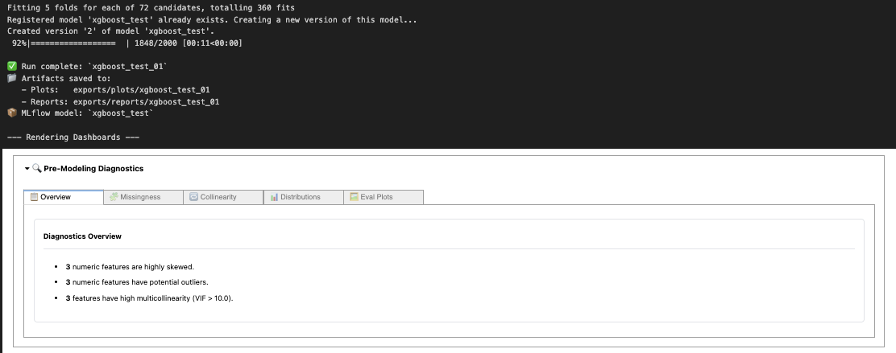
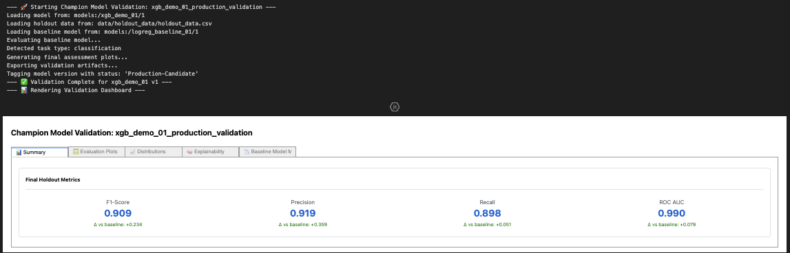
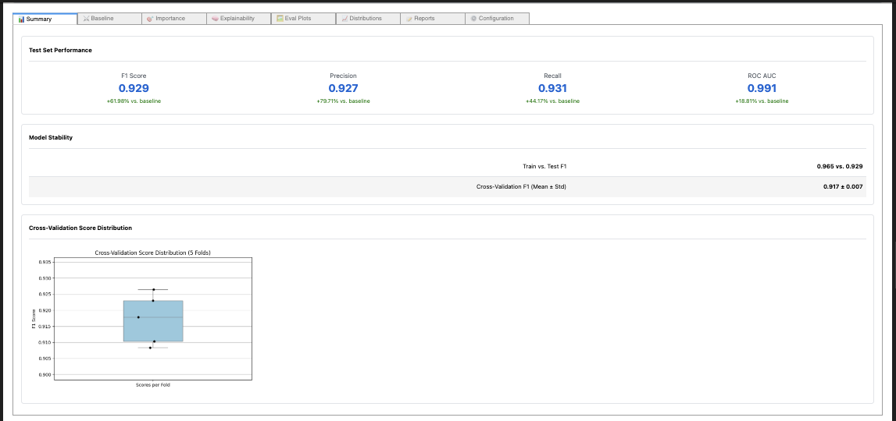
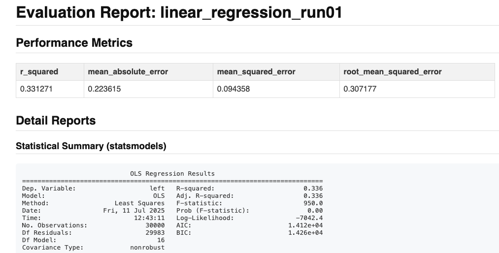
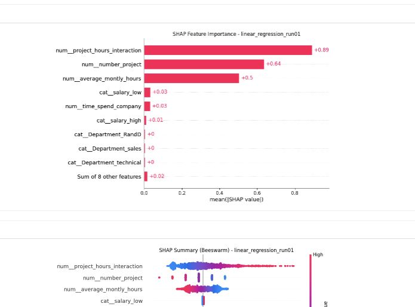

<file name=0 path=/Users/garrettschumacher/Documents/git_repos/model_evaluation_suite/README.md><p align="center">
  
  <br>
  <em>Model Evaluation + Interpretability Engine</em>
</p>
<p align="center">
  
  
  
</p>

---

# 🧠 Model Evaluation Suite

A modular Python package for evaluating machine learning models across regression and binary classification tasks. Features dashboarding, explainability, baseline comparisons, and audit alerts — all driven by a single YAML configuration.

---

## 📦 TL;DR

- Drop-in evaluation engine for scikit-learn pipelines  
- Modular explainability and validation dashboards  
- MLFlow integration for model tracking and reproducibility  
- YAML-driven runner with CLI and notebook support  
- SHAP, permutation importance, lift/PR/ROC curves  
- Audit alert system for overfitting, instability, and regressions  
- Interactive dashboards with HTML export support  
- Designed for analysts, MLOps teams, and reproducible portfolios  

<details>
<summary>📌 Data Analyst Portfolio Highlights</summary>

If you're reviewing this repository as part of a hiring process, start here:

- [`notebooks/demo.ipynb`](notebooks/demo.ipynb): Full modeling run with commentary, inline QA, SHAP explanations, and visual diagnostics — simulates a real analyst’s interpretability workflow  
- [`exports/sample/`](exports/sample/): Output artifacts from live runs, including statistical summaries, validation reports, feature distribution plots, and production-ready dashboards  
- [`resource_hub/notebook_resources/notebook_walkthrough.md`](resource_hub/notebook_resources/notebook_walkthrough.md): Step-by-step narrative of how the evaluation system works — from raw model to stakeholder report  
- [`resource_hub/hub_index.md`](resource_hub/hub_index.md): Analyst-focused documentation portal covering every module: data profiling, schema validation, imputation, certification, audit logic, and more  
- [`resource_hub/config_resources/config_guide.md`](resource_hub/config_resources/config_guide.md): YAML-driven QA infrastructure showing how data analysts can configure and enforce quality gates without rewriting code  

This system is designed for analysts who want to **interpret, validate, and communicate model results**, not just build them. It emphasizes **data quality**, **explainability**, and **reproducibility** — key pillars of modern analytics work.

</details>

## 📐 What This Suite Includes

Beyond standard evaluation, this suite offers a full workflow ecosystem:

- **Centralized Resource Hub**: YAML templates, guides, and model config tools
- **Pre-Diagnostics Module**:Integrated distribution analysis, outlier checks, and multicollinearity audits
- **Data Loading and Isolation**: One-time stratified train/test/holdout split with YAML-configured paths
- **Champion Model Validation**: Post-deployment evaluation with MLflow tag comparison and segmentation charts
- **Dashboard Generation**: Interactive visual reports for model explainability, alerts, and performance
- **Audit and Risk Detection**: Surface issues like overfitting, CV instability, and performance regressions
- **MLflow + Artifact Logging**: MLflow logging, model tagging, and export of HTML reports, plots, and metrics logs

---

# 📘 Project Guidebook

### 📚 Demo & Quick Start Notebooks

<p align="left">
  <a href="notebooks/demo.ipynb">
    
  </a>
  &nbsp;&nbsp;
  <a href="notebooks/quick_start.ipynb">
    
  </a>
</p>

___


### 🧭 Orientation & Getting Started

<details>
<summary><strong>🧠 Notes from the Dev Team</strong></summary>
<br>

**Why build a system for evaluation, not just a script?**

The Model Evaluation Suite exists to support one of the most critical steps in machine learning: **trustworthy, reproducible evaluation.**

This system is built for analysts, data scientists, and ML engineers who want:

- Clean YAML-driven evaluation pipelines that are simple and repeatable
- Baseline comparisons, SHAP interpretability, and validation alerts **in one place**
- A system that **fails loudly** and surfaces risk **before** production

You don’t just train a model — you understand it, you interrogate it, and you document its behavior.

Every evaluation leaves behind a record: dashboards, audit warnings, model checkpoints, metric logs. You get visibility into performance drift, overfitting, variance, and gaps — the kinds of things that don't show up in a single accuracy number.

It’s designed for teams, for experimentation, and for scale — with modular components you can mix, override, and build on.

**Human-readable. YAML-driven. Production-conscious.**

</details>

<details>
<summary><strong>🫆 version release v0.1.0</strong></summary>

**v0.1.0**
- Core evaluation engine for classification and regression tasks
- YAML-driven pipeline with CLI and notebook support
- Modular dashboard rendering with SHAP, audit alerts, and baseline comparison
- Auto-logging to MLFlow & CSV for model traceability
- Regression and classifier support with audit logic and explainer fallback
- Binary classification only (F1, ROC AUC, etc.)
- CLI-driven validation workflows and champion comparison

**Planned for v0.2.0**
- Multiclass classification support (per-class metrics + confusion matrix)
- Advanced plotting extension: Interactive plotting with export support
- Streamlined stakeholder report: polished, printable HTML export
- Performance drift monitoring across validation runs
- Expand the test module to include end to end CLI smoke test, and extend to other critical modules
  
</details>

<details><summary>🔗 Resource Hub Links</summary>

> Visit the Resource Hub: [hub_index.md](resource_hub/hub_index.md)

#### 🧩 Configuration Resources
- [Configuration Guide](resource_hub/config_resources/config_guide.md) — YAML structure, templates, and examples
- [Model Factory Parameters](resource_hub/config_resources/model_factory_params.md) — Valid model names and hyperparameters
- [Model Codex](resource_hub/config_resources/model_codex.md) — Supported estimators and pipeline behavior
- [Annotated Config Examples](resource_hub/config_resources/annotated_example_yaml/) — Training + validation YAML examples
- [General Template Config](resource_hub/config_resources/template_yaml/) — Empty YAML templates for quick setup
- [YAML Template Bundle](resource_hub/config_resources/config.zip) — Downloadable starter config pack

#### ⚙️ Modeling Resources
- [Feature Engineering Guide](resource_hub/modeling_resources/feature_engineering.md) — How to plug in your own custom transformer
- [MLflow Integration Guide](resource_hub/modeling_resources/MLFlow.md) — Setup, model registration, and tracking

#### 📓 Notebook Resources
- [Notebook Walkthrough](resource_hub/notebook_resources/notebook_walkthrough.md) — End-to-end workflow in Jupyter Notebooks

#### 🖥️ CLI Resources
- [CLI Usage Guide](resource_hub/CLI_resources/cli_usage_guide.md) — End-to-end workflow in command-line.

</details>

<details>
<summary>📦 Package Structure</summary>

```
📦 src/model_eval_suite
├── validate_champion.py        # Champion model validation and audit runner
├── data_prep.py                # One-time data preparation utility for structured model input
├── run_pipeline.py             # Main runner (YAML-driven)
├── config/                     # Core default YAML used to control main pipeline, modules, and evaluation settings
├── classification/             # Classifier evaluators and dashboards
├── regression/                 # Regression evaluators and dashboards
├── utils/                      # Config, logging, export, shared diagnostics, and widgets
├── modeling/                   # Feature engineering and pipeline factories
├── validation/                 # Champion model validator
└── tests/                      # Unit test scaffolding
```

</details>

<details>
<summary><strong>🏢 Salifort HR 50k: Workforce Churn Simulation Dataset</strong></summary>
<br>

This evaluation suite ships with the **Salifort HR 50k** dataset — a fully synthetic, upscaled version of the Salifort Motors, Human Resources dataset. Commonly used in the Google Advanced Data Analytics Certificate Capstone project, the original synthetic dataset is available on Kaggle:<br>

- 📂 **HR Salifort Motors Dataset** — ~15k rows, 10 features  
  🔗 [View on Kaggle](https://www.kaggle.com/datasets/jacopoferretti/salifort-motors-dataset)

👥 **Features include**:
- Binary churn target (employee left vs. stayed)
- Employee attributes (tenure, satisfaction, monthly hours, etc.)
- Categorical features including department, salary, and promotion history

🔍 **Modifications in this suite**:
- **Upscaled to 50,000 rows** to support benchmarking and SHAP visualizations
- Cleaned and formatted for consistency
- Expanded to include both classification and regression targets for modeling workflows

This dataset supports both **binary classification** (churn) and **regression** (e.g., project_hours_interaction), and is used throughout the suite's notebooks and dashboards.

</details>

## 🧰 Installation

The suite can be installed in a few different ways depending on your setup. Below are detailed instructions for prerequisites, Conda environments, and installation methods — including GitHub-based install and editable mode for development.

<details>
<summary>📦 Prerequisites</summary>

Before installation, ensure your environment meets the following requirements:

- **Python 3.9+**  
  The suite requires Python 3.9 or higher (see `pyproject.toml`).

- **Core Dependencies**  
  Built on standard ML and scientific packages:
  - `scikit-learn`, `xgboost`, `shap`, `pandas`, `numpy`
  - Visualization: `matplotlib`, `seaborn`, `ipywidgets`
  - Logging & tracking: `mlflow>=2.10`, `joblib`, `pyarrow`, `openpyxl`

- **Notebook Support (Optional)**  
  Required for dashboard rendering:
  - `jupyter`, `ipykernel`, `ipywidgets`

- **Protobuf Compatibility**  
  Version is pinned to `<4` to avoid SHAP and MLflow issues.

- **Developer Tools (Optional)**  
  - Formatters: `black`, `pylint`
  - Testing: `pytest`

</details>

<details>
<summary>🧪 Conda Environment Setup</summary>

```bash
# Create and activate conda environment
conda create -n model_eval_suite python=3.9
conda activate model_eval_suite
```

</details>

<details>
<summary>🔧 Local Development</summary>

Clone the repo and install locally using the provided `pyproject.toml`:

```bash
git clone https://github.com/G-Schumacher44/model_evaluation_suite.git
cd model_evaluation_suite
pip install -e .
```

</details>

<details>
<summary>🌐 Install Directly via GitHub</summary>

```bash
pip install git+https://github.com/G-Schumacher44/model_evaluation_suite.git
```

To target a specific branch or tag, append `@branchname` or `@v0.1.0` to the URL.

</details>

</details>


## ⚙️ Configuration Resources

#### 📚 **Configuration Guide**  
[🔗 docs/configuration_guide.md](resource_hub/config_resources/config_guide.md)  
Comprehensive walkthrough of the YAML structure — covering core sections like `modeling`, `evaluation`, `paths`, and common override strategies for different use cases.

<details><summary>📎 Additional Links</summary>

📁 **Example YAML Files**  
Ready-to-use configurations for typical workflows:

- 🧼 **Data Prep Config** — [example_config/example_data_prep.yaml](resource_hub/config_resources/annotated_example_yaml/example_data_prep.yaml)  
  Defines input/output paths and target column for train/test/holdout splits.

- ⚙️ **Base Config Template** — [example_config/default_config_example.yaml](resource_hub/config_resources/annotated_example_yaml/example_default_config.yaml)  
  Full structure for classification pipelines; ideal as a starting point.

- 🔁 **Model Override Example** — [example_config/example_override.yaml](resource_hub/config_resources/annotated_example_yaml/example_modeling.yaml)  
  Demonstrates how to override pipeline type, parameters, and features.

- 🏆 **Champion Validation Config** — [example_config/example_validation_template.yaml](resource_hub/config_resources/annotated_example_yaml/example_validation_template.yaml)  
  Used to compare trained models against a tagged MLflow baseline in production.

</details>

<details><summary>🔍 Example</summary>

```yaml
evaluation:
  run: true
  compare_to_baseline: "logreg_final_QA_01"
  export_html_dashboard: true
  explainability:
    run_shap: true
    shap_sample_size: 1500
```

</details>

</details>

---

## ▶️ Usage Overview

This suite can be used in either a modular notebook workflow (ideal for experimentation and EDA) or YAML-driven CLI runs (for production, validation, or automation). Below are examples for each step — data prep, evaluation, and champion comparison.

---

#### ▶️ Notebook Workflow

<details>
<summary>🧼 Data Preparation</summary>

**Python:**
```python
from model_eval_suite.data_prep import main as prep_data
prep_data(user_config_path="config/data_prep_config.yaml")
```

</details>

<details>
<summary>📓 Evaluation</summary>

**Python:**
```python
from model_eval_suite.run_pipeline import main as run_experiment
run_experiment(user_config_path="config/example_override.yaml")
```
</details>

<details>
<summary>🏆 Champion Validation</summary>

**Python:**
```python
from model_eval_suite.validate_champion import validate_and_display
validate_and_display(config_path="config/example_validation.yaml")
```
</details>

>📓 Notebook Usage Tutorial  
[🔗 Demo & Tutorial Notebook](notebooks/demo.ipynb)  
Modular, interactive notebook demonstrating the full evaluation process — from data prep to validation dashboards.

</details>

#### ▶️ CLI Workflow

<details>
<summary>🧼 Data Preparation (CLI)</summary>

**CLI:**
```bash
python -m model_eval_suite.data_prep --config config/data_prep_config.yaml
```
</details>

<details>
<summary>🔁 Evaluation (CLI)</summary>

**CLI:**
```bash
python -m model_eval_suite.run_pipeline --config config/example_override.yaml
```
</details>

<details>
<summary>🏆 Champion Validation (CLI)</summary>

**CLI:**
```bash
python -m model_eval_suite.validate_champion --config config/example_validation.yaml
```
</details>

>🔁 CLI Resources  
[🔗 CLI Usage Guide](resource_hub/CLI_resources/cli_usage_guide.md)  
Command-line usage and configuration examples for data prep, evaluation, and champion comparison workflows.

## 🖥️ Notebook Dashboards 

The dashboard system provides a unified view of model quality, explainability, and risk diagnostics. Each tab (pre-diagnostics, evaluation, validation) surfaces different insights — from feature distribution health to audit flags and segment-based performance.

📁 Outputs are generated automatically during evaluation and saved to data/reports/{run_id}/.

<details>
<summary><strong>📃 Dashboard Snapshots</strong></summary>

<div style="display: flex; gap: 20px; justify-content: center;">
  
  
</div>
<br>
<div style="display: flex; justify-content: center; margin-top: 20px;">
  
</div>

</details>

</details>


## 📤 HTML Reports

Each modeling run can generate a static **multi-tab HTML report**, containing:

- Model summary and KPI cards
- SHAP explainability (local/global)
- Permutation importance
- ROC / PR / Lift curves
- Validation audit alerts
- Segment-level performance

While the exported HTML is **not interactive**, it mirrors the notebook dashboard layout and is ideal for **stakeholder sharing**, **record-keeping**, or **offline reviews**.

Reports are saved to: `data/reports/{run_id}/{run_id}_dashboard.html`

> 🔗 [View Sample Static Report](exports/sample/linreg_demo_01/static_report_linreg_demo_01.html)

<details>
<summary><strong>📸 Preview Screenshots</strong></summary>

<p align="center">
  
  <br><br>
  
</p>

</details>

## 🤝 On Generative AI Use

Generative AI tools (Gemini 2.5-PRO, ChatGPT 4o - 4.1) were used throughout this project as part of an integrated workflow — supporting code generation, documentation refinement, and idea testing. These tools accelerated development, but the logic, structure, and documentation reflect intentional, human-led design. This repository reflects a collaborative process: where automation supports clarity, and iteration deepens understanding.

---

## 📦 Licensing

This project is licensed under the [MIT License](LICENSE).</file>

---


### 📎 Quicklinks
> Return to the resource hub index: [Resource Hub Index](resource_hub/hub_index.md)  