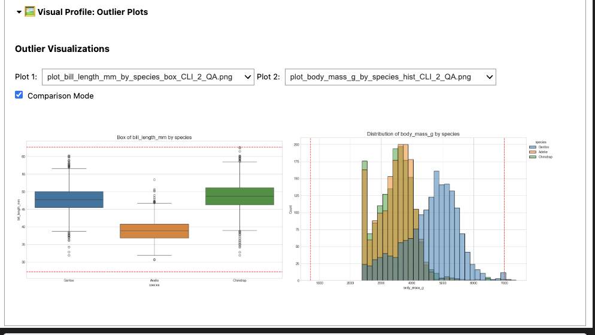

# 🖼️ Plot Viewer – GitHub Preview Note

> ⚠️ The `plot_viewer()` dashboard does **not render properly on GitHub.**

This viewer uses `ipywidgets` to enable dropdowns and interactive plot browsing inside Jupyter notebooks. GitHub's static notebook viewer **does not support these widgets**, which is why it may appear broken or blank in preview.

---

## ✅ Example of Use in Jupyter Notebook

<p align="center">
  
</p>

This widget enables interactive dropdowns, comparison mode toggling, and inline image previews for `.png`, `.jpg`, or `.svg` files.

---

## 💡 Tip

To view this properly:

- Open the notebook in **Jupyter Lab** or **VS Code with Jupyter extension**
- Make sure `ipywidgets` is installed and enabled
- Use `viewer.render()` after instantiating the widget

___


# 🖼️ Using the PlotViewer Widget

The PlotViewer_Outliers widget is a standalone visual inspection tool for browsing and comparing image-based plots inside Jupyter notebooks.

It is ideal for:
- QA comparisons of before/after plots
- Reviewing exported visualizations from any pipeline
- Lightweight manual inspection during EDA


## 🔧 Requirements
- ipywidgets
- Jupyter Notebook / JupyterLab
- A directory containing image files (.png, .jpg, .svg, etc.)

## ✅ Basic Usage

``` python
from analyst_tookit.m00_utils.plot_viewer_comparison import PlotViewer_Outliers

viewer = PlotViewer_Outliers(image_dir="exports/plots", title="Outlier Inspection")
viewer.render()

```

## 📂 File Structure Example

```
your_project/
│
├── notebooks/
│   └── qa_check_notebook.ipynb
│
├── exports/
│   └── plots/
│       ├── zscore_plot.png
│       ├── iqr_outliers.png
│       ├── boxplot.png
│       └── ...
│
└── plot_viewer_comparison.py
```

## 🛠️ Features
- Directory-based loading: reads all supported image types from a folder
- Dropdown UI: select plots to view
- Comparison Mode: toggle side-by-side plot comparison
- Resizable: height and width automatically adjust depending on mode


### 💡 Tip: Use Outside the Toolkit

You don’t need to install the full analyst_toolkit to use this. Just copy the PlotViewer_Outliers class into any notebook or script, and point it at a directory of plots.